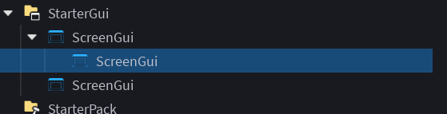

# Reparenting Instances Using Drag and Drop

To start dragging instances, you can hold left click on one of the instances that's in your current selection and move your mouse to create a drag frame.

(Drag frame.)

Keep holding left click until you've found the instance you wanna reparent your selection into, then "drop" the drag frame into your desired instance by releasing left click while your mouse is hovered above it.

This will reparent all instances within your current selection into the instance you just dropped into.

