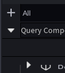

# The Dropdown Menu

The dropdown menu is the menu accessible by clicking the little downwards-pointing arrow on the top left corner of the plugin widget.

(the arrow)

It allows you to open the widgets for all of Jexplorer's Editors and also displays a few utility buttons such as for resetting certain state or refreshing the virtual scroller.

(the menu)
