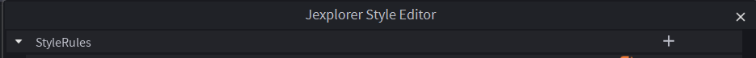
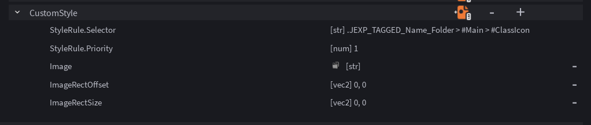
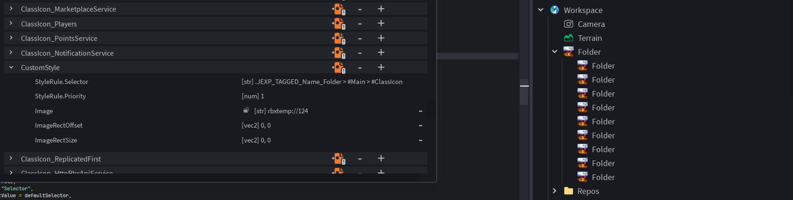

# Making Custom Explorer Icons

Before reading this page, you should read the page about the [style editor](../editors/style_editor.md) first.

To make a custom explorer icon, you must first open the style editor, then click the "+" button inside the main "Rules" dropdown.

(click the "+" button here, the one opposite of "StyleRules")

Once you've clicked the "+" button, a little menu should appear in the main Jexplorer widget prompting you to input a "Selector" and "Priority".

To make a custom explorer icon, input this macro as "Selector", input your desired values:

`@icon(Name?, Class?)`

Example usage:

`@icon(Scripts, Folder)`
`@icon(nil, Part)`
`@icon(Character, nil)`

If both arguments are provided, the icon will only be applied to instances whose names and ClassNames match the provided arguments.

Else it'll only apply if it matches the one you provided, either name or ClassName.

Once you've input the "Selector", now input "Priority" as anything above 0 (the default priority for explorer icons is 0, anything above it and you'll be overriding the default ones)

Finally, click "Create" to create your new StyleRule.

Once you've done this, scroll down to the very bottom of the StyleRules list and you'll see a new dropdown with the name "CustomStyle"

Open the dropdown and you'll see that some fields are already filled out, such as `Image`, `ImageRectSize` and `ImageRectOffset`. The one we are interested in is `Image`

To import your very own explorer icon for this style, simply click the little folder icon next to `Image`. This will prompt you to insert a png/jpg/jpeg file, which will be used as the explorer icon for the style.

Once you've imported your image, the new explorer icon should instantly apply to all instances who fit the arguments you passed into `@icon()`! (In this example, all instances named "Folder" regardless of ClassName will have the "lebron shooting into heaven from hell" meme explorer icon applied!)

